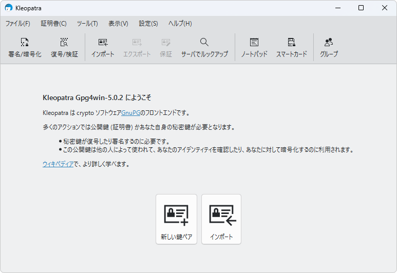
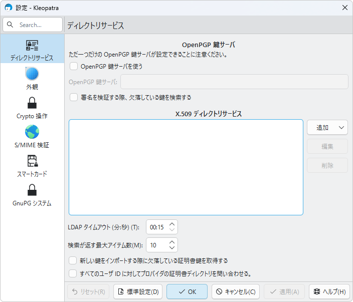
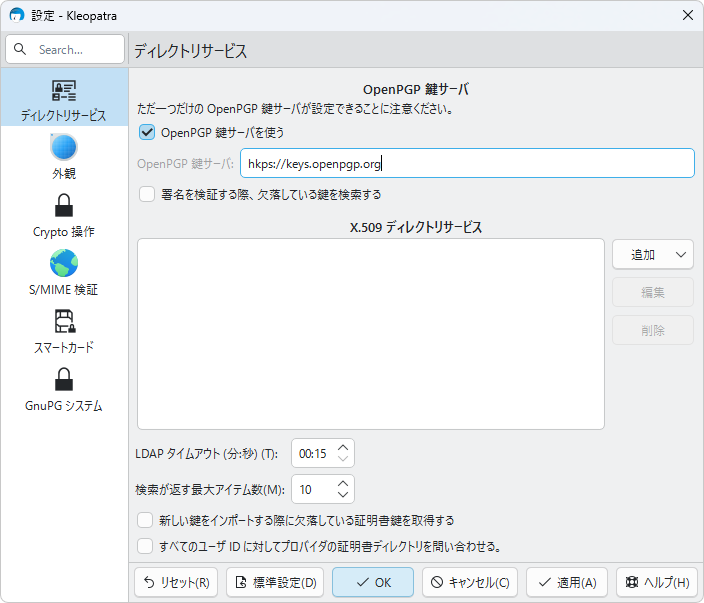
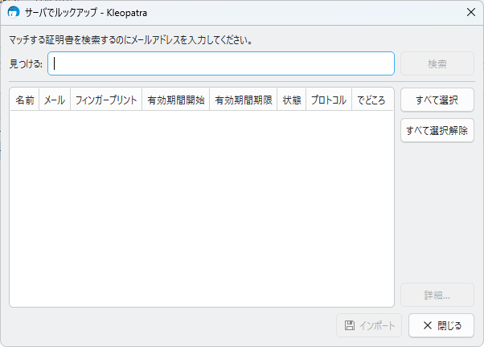
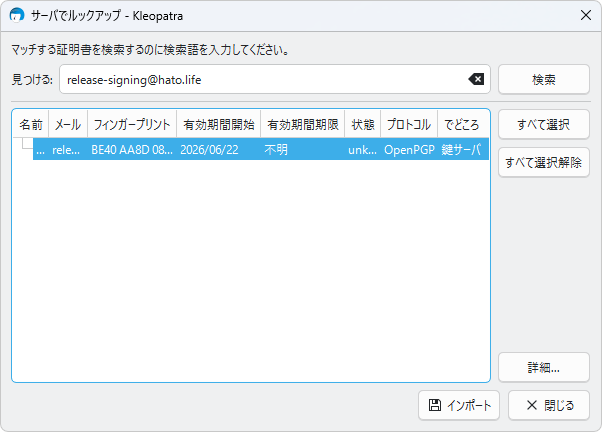
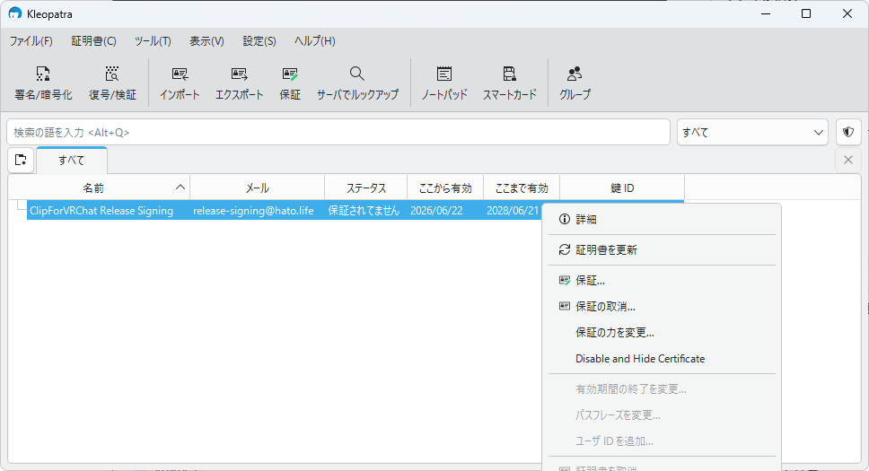
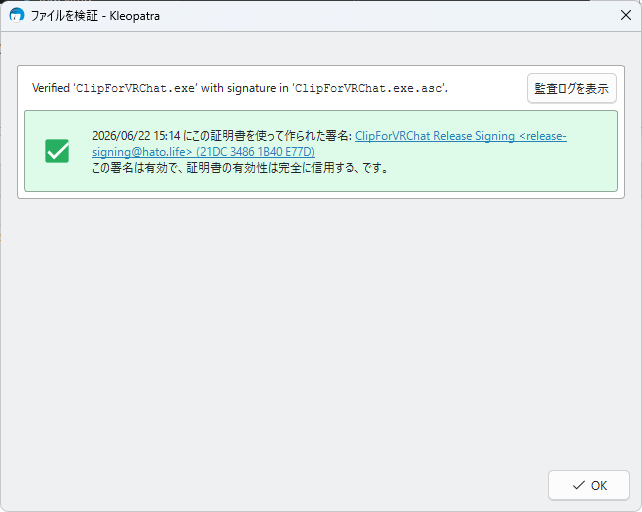
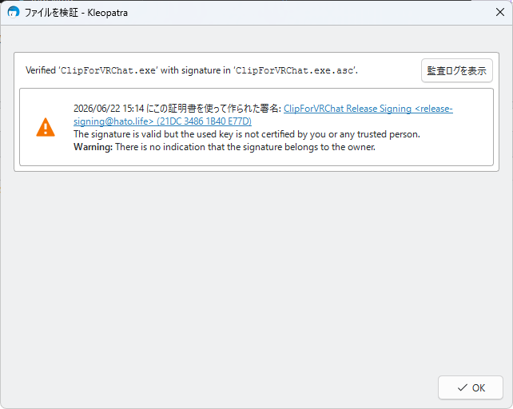

# 実行ファイルのPGP署名を確認する

結論: WindowsではKleopatraで確認します。

`.exe` と `.exe.asc` を同じフォルダーに置き、`.exe.asc` をKleopatraで検証します。
hato.lifeの実行ファイルは、`hkps://keys.openpgp.org/` から `release-signing@hato.life` を検索して取得したCIリリース用公開鍵で確認します。

Kleopatraを入れていない場合は、先にこちらを読んでください。

- [Kleopatraとは](./about.md)
- [Gpg4winを取得してインストールする](./install.md)

## 1. Kleopatraを開く

Gpg4winを入れると、Kleopatraも一緒に入ります。
スタートメニューからKleopatraを起動します。



## 2. 鍵サーバーを設定する

設定画面を開き、OpenPGP鍵サーバーに `hkps://keys.openpgp.org/` を設定します。



`OpenPGP 鍵サーバを使う` にチェックを入れ、次の値を入力します。

```text
hkps://keys.openpgp.org/
```



## 3. CIリリース用公開鍵を検索する

Kleopatra上部の `サーバでルックアップ` を開きます。



検索欄に次を入力します。

```text
release-signing@hato.life
```

検索結果にCIリリース用の鍵が表示されたら、選択してインポートします。



## 4. Fingerprintを確認する

インポートした鍵のFingerprintが次と一致するか確認します。

```text
BE40AA8D082F493F613BC07221DC34861B40E77D
```

表示上は末尾が `21DC 3486 1B40 E77D` のように区切られて見えます。



署名確認だけなら、このFingerprint一致の確認が重要です。
鍵を保証する操作は、Kleopatra内で信頼表示を強くしたい場合の追加作業です。

## 5. exeとascを同じフォルダーに置く

リリースページから、実行ファイルと署名ファイルを保存します。

```text
ClipForVRChat.exe
ClipForVRChat.exe.asc
```

ファイル名は例です。
実際には、確認したい `.exe` と、それに対応する `.exe.asc` を同じフォルダーに置きます。

## 6. ascをKleopatraで検証する

`.exe.asc` をKleopatraへドラッグ&ドロップします。
Kleopatraが同じフォルダーの `.exe` を見つけて、署名を確認します。

## 7. 結果を見る

緑のチェックで、署名者がCIリリース用公開鍵になっていれば確認完了です。



黄色い警告が出る場合があります。
これは「署名は有効だが、この鍵をあなたが信頼済みにしていない」という意味です。
FingerprintがCIリリース用と一致しているか確認してください。



赤いエラー、`Bad`、`Invalid signature` が出た場合は、その `.exe` を実行しないでください。
